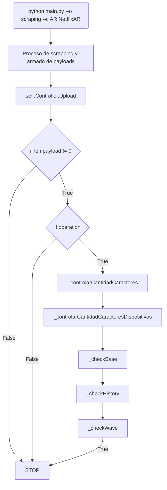

<h1 align="center">
  <br>
  <a href="https://bb.vision/"></a>
  Plans, Prices & Bundles
</h1>

## 📖 Índice
  - [😄 Introducción](#introduccion)
    - [Objetivo](#objetivo)
    - [Organización y comunicación](#organizacion)
    - [Puntos Importantes](#puntos_importantes)

  - [📚 Documentación para analizar metadata](#documentacion_metadata)
    - [🔬 Cómo empezar a analizar la metadata](#analizar_metadata)
      - [Hoja "Platforms"](#hoja_platforms)
      - [Hoja "Plans & Prices"](#hoja_pp)
    - [📗 Tips para usar Excel](#excel)

  - [🎓 Guía de inicio y buenas prácticas](#inicio_y_practicas)
    - [👨‍⚖️ Aclaraciones importantes](#aclaraciones_importantes)
    - [👩‍💻 Instalación de nustro entorno de trabajo](#instalación_entorno)
      - [Clonar el repositorio](#clonar_repo)
      - [Crear un entorno virtual](#entorno_virtual)
      - [Instalar las dependencias](#instalar_dependencias)
      - [Instalar MongoDB](#instalar_mongo)
      - [Conectar MongoDB](#conectar_mongo)
    - [👩‍🏫 Convenciones del equipo y buenas prácticas](#convenciones_equipo)
      - [Idioma](#convenciones_idioma)
      - [Buenas prácticas](#convenciones_practicas)
      - [Commits](#convenciones_commits)
      - [Rama master](#convenciones_master)
      - [Otras Ramas](#convenciones_otras)
      - [Importante](#convenciones_importantes)
    - [👨‍🍳 Realizar un alta](#altas)
      - [Inicio en config.yaml](#inicio_config)
      - [Crear archivo.py](#crear_script)
        - [Nombre del archivo](#nombre_script)
        - [Nombre de la clase](#clase_script)
        - [Inicio/Plantilla de un script](#inicio_script)
        - [Ejecución de un script](#ejecucion_script)
    - [👷 Estructura de datos](#estructura_datos)
      - [Que es un payload?](#payload)
      - [Partes de un payload](#payload_partes)
    - [🔧 Funciones importantes](#funciones_importantes)
      - [Controller](#objeto_controller)
        - [lengthCaracteresDispositivo()](#length_dispositivo)
        - [lengthCaracteresChannel()](#length_channel)
          - [Filtros](#filtros)
          - [Parámetros](#length_channel_params)
        - [Upload](#upload)

  - [🔌 Servidores, roots y últimos detalles que debemos saber](#servidores_roots)
    - [🚪 Roots](#roots)
      - [Como insertar una plataforma a un root con VPN](#plataforma_root_vpn)
      - [Como insertar una plataforma a un root sin VPN](#plataforma_root)
    - [💡 Cómo ejecutar un root?](#ejecutar_root)

  - [⭐ Filtros, Controller y Root en profundidad](#advanced)
    - [🎁 Root](#advanced_root)
    - [🔮 Filtros](#advanced_filter)
    - [🗿 PPWin](#advanced_ppwin)


<br><br><br>

<!-- BB - Plans, Prices & Bundles -->
<p id = "introduccion"></p>

## 😄 Introducción.
  En este espacio contamos lo más breve posible, todo lo que debe saber un/a desarrollador/a que esté trabajando dentro de este repositorio.

  En **BB** hay varios proyectos y desarrollos en constante crecimiento, en nuestro caso somos parte del equipo llamado **"Precios, Planes & Bundles"**.

  <p id = "objetivo"></p>

  Tenemos como objetivo mantener el correcto funcionamiento de más de 2500+ [**plataformas**](#w_plataforma)**/scripts** y cubrir las plataformas nuevas que se vayan relevando con el tiempo. 
  Estos scripts que desarrollamos pueden ser considerados "bots" automatizados, que se encargan de checkear **cambios de caracteres** (para detectar ofertas) y actualizaciones en sus **precios y planes**, que en caso de detectarse se carga a la base de datos y se **genera una alerta** indicandole el cambio a el [**equipo de relevamiento**](#w_team_relevamiento) que ademas de en un principio realizar el [**relevamiento**](#w_relevamiento) de las plataformas,verifican si estas alertas son correctas y actualizan los datos que tienen.  
  ***En resumen, realizamos un proceso ETL (Extract, transform and load).***


  Nuestro trabajo va desde escribir código y consultar bases de datos, hasta hacer un relevamiento muy leve en algunos casos para verificar si lo relevado tiene que ser actualizado o no. Pero sobre esto vamos a hablar más adelante.  

  **Espero que disfrutes esta introducción, empecemos a aprender sobre el proyecto y nuestras tareas!**

  <br>

  <p id = "organizacion"></p>
  Para simplificar nuestro trabajo preferimos organizarnos y comunicarnos de la siguiente manera:


  <p>
    
  </p>

  Usamos [ **ClickUp**](https://app.clickup.com/) para organizar nuestros proyectos y tener un seguimiento de nuestro trabajo en [altas](#w_altas).

  <p>
    
  </p>

  Usamos [**Microsoft Teams**](https://www.microsoft.com/es-ar/microsoft-teams/group-chat-software). Tenemos canales y chats para seguir los temas relacionados a nuestros proyectos y el trabajo diario.

  <p>
    
  </p>

  Usamos libros de [**Excel**](https://businessbureau0.sharepoint.com/:f:/s/IT2/EpCqiHDLhJBEgxMiAdAfAZABk0YIev3o2CbNWwRLFqDVCg?e=nezd6n) para organizar nuestros tareas diarias de mantenimiento y análisis.

  <p>
    
  </p>

  Usamos [**Microsoft Sharepoint**](https://businessbureau0.sharepoint.com/sites/IT2) para realizar posteos de novedades, cosas que queramos comunicar al equipo o el resto de la empresa.

  <br>

  <p id = "puntos_importantes"></p>

  **Básicamente, en este proyecto trabajamos teniendo en cuenta tres puntos importantes:**
  1) Checkear los datos relevados por el **equipo de relevamiento**.
  1) [Scrapear](w_scrapear) **precios y planes** de la plataforma [**OTT**](#w_ott) correspondiente.
  3) Mantener en funcionamiento los servidores.


  Para el **1er** punto, antes que nada, es necesario leer y entender el apartado [**Documentación para analizar metadata**.](#documentacion_metadata)

  Para el **2do** punto, es necesario leer y entender el apartado [**Guía de inicio y buenas prácticas**.](#inicio_y_practicas)

  Y por último, para el **3er** punto, es necesario leer y entender el apartado [**Servidores, roots y últimos detalles que debemos saber.**.](#servidores_roots)

  Estos **tres puntos importantes**, los explicamos paso a paso a lo largo de este documento, así que no te vayas!

  <br><br><br>

<p id = "documentacion_metadata">ㅤ</p>

## 📚 **1 - Documentación para analizar metadata.**

  <p id = "analizar_metadata"></p>

  #### 🔬 Cómo empezar a analizar la metadata.

  Primero que todo vamos a ir a la carpeta en donde están los archivos del **equipo de relevamiento** [**Más información haciendo click aquí.**](https://businessbureau0.sharepoint.com/:f:/s/BB-ContentPulse/EodjqPNFwzRIjaYIxG_qxioB7SKSVnHlWQujiGPMOa2guw?e=QxFoc1)
  > En el caso de que haga falta algún archivo podemos a enviártelo por teams.

  Ya sea para realizar un [alta](#w_alta), solucionar un [bug](#w_bug), o realizar el [mantenimiento](#w_mantenimiento) de una plataforma ya existente, vamos a apoyarnos sobre los relevamientos previamente realizados por el **equipo de relevamiento** buscando ser los más fieles posibles a esos datos.
  > Si notas que hay otros datos a los relevados y consideras que el equipo de relevamiento debería tenerlos en cuenta, no dudes en comentarselos! Somos un equipo y entre todos nos ayudamos la tener la mejor calidad de datos posible.
  <br>

  En general vamos a hacer uso de los archivos que sean individuales de cada persona en donde lleven registro de los updates que vayan haciendo de las plataformas. Por el momento solo vamos a prestarle atención a la hoja **Platforms** del archivo Excel.  

  <p id = "hoja_platforms"></p>

  **Dentro de ese archivo tenemos que prestarle mucha atención a las siguientes columnas:**

  - **Platform Code**
  > Este codigo va a identificar de forma única a la plataforma, más adelante vamos a ver donde utilizarlo. Hay que prestar mucha atención a no ingresar otro o tener un error de tipeo.

  - **Country**
  > Con este dato vamos a checkear que estamos mirando la plataforma en el país que corresponde, nunca está de más verificar.

  - **Platform**
  > El dato más importante de esta hoja mas adelante vamos a verlo como **Platform Name**, muchas veces aunque nos parezca que una plataforma se llama de una manera puede ser que sea otro. Vamos a usar este dato para mantener cierta congruencia en los datos y evitar errores.  
  
  De la hoja **Platforms** ya no hay muchos datos relavantes para nosotros, ahora podemos pasar a prestarle atención a la hoja **Plans & Prices**.  

  <p id = "hoja_pp"></p>

  **Dentro de ese archivo tenemos que prestarle mucha atención a las siguientes columnas:**

  - **Platform Code**
  > Este codigo va a identificar de forma única a la plataforma, más adelante vamos a ver donde utilizarlo. Hay que prestar mucha atención a no ingresar otro o tener un error de tipeo.

  - **Product Type**
  > Podemos checkear el tipo de producto con el que vamos a trabajar. Si es un tipo de contenido que no sea SusbcriptionVOD vamos a priorizar la obtención de caracteres por encima del scrap de datos de Precios y Planes (vamos a ver esto también más adelante)

  - **Plan Name**
  > Es el nombre del plan, al igual que el platformCode hay que mantenernos lo más fieles a los datos relevados. 

  - **Currency**
  > Es la moneda en la que el plan está valuado. Nos sirve como referencia a la hora de checkear si los VPNs están funcionando de manera correcta. 

  - **Price**
  > Es el valor del plan. El dato con mayor relevancia. Hacer un buen uno de limpieza de datos en caso de ser necesario para poder obtener el precio que corresponde.
  
  - **Plan Status**
  > Esta columna nos indica si el plan en cuestión sigue activo o no. Antes de dejar de scrapear un plan desde un script checkear si el equipo de relevamiento ya notó el cambio. En caso de que no lo hayan hecho es una buena idea comentarselos!

  - **Plan URL**
  > URL de la plataforma donde se encuentra el plan. En lo posible mantener el mismo link que usan y en caso de no poder hacerlo comentarles que hubo un problema y tenemos que usar otro.

  - **Devices URL**
  > URL de la plataforma donde se encuentran los dispositivos. En lo posible mantener el mismo link que usan y en caso de no poder hacerlo comentarles que hubo un problema y tenemos que usar otro.
  <br>

  <p id = "excel"></p>

  #### 📗 Tips para usar Excel.

  Hay que estar muy atentos a la hora de manejarnos con los excels del **equipo de relevamiento**, gran cantidad de **sus datos son sensibles** y no tienen que ser modificados.  
  Por otro lado no es nuestro deber hacer correcciones manuales en el mismo, por lo que de detectar alguna incongruencia o error en esos datos basta con comentarselo a la persona que figura en el nombre del archivo Excel.

  Siguiendo el punto de intentar no modificar estos archivos Excel, es una buena práctica hacer uso de vistas temporales para poder filtrar los datos sin problemas.  
  
  Podemos encontrar esta función en el apartado de **Vistas**, una vez estemos en esa pestaña la opción suele estar a la izquierda, clickeando donde dice **Nuevo**.  
  Para salir de esta vista temporal basta con ir al mismo apartado pero en vez de clickear **Nuevo**, clickeamos **Salir** y elegimos **no guardar la vista**.  

  <br><br><br>


<p id = "inicio_y_practicas"></p>

## 🎓 **2 - Guía de inicio y buenas prácticas.**

  <p id = "aclaraciones_importantes"></p>

  #### 👨‍⚖️ Aclaraciones importantes.

  El código fuente de este repositorio es **propiedad de BB-Media** y está prohibida su difusión y/o utilización por intereses ajenos a la empresa.

  Por otro lado, sabemos que muchos de nosotros somos desarrolladores, nerds, entusiastas y **siempre vemos muchas cosas para mejorar**. Pero hoy **"Precios, Planes & Bundles"** está en crecimiento, y un mínimo cambio por fuera de estos archivos en los cuales indicamos desarrollar nuestro código, puede generar problemas en la operación diaria.

  Es por esto, que las ideas de mejora, las estamos volcando en este [**link**](https://app.clickup.com/3043480/v/l/6-13747228-1?pr=3090372), para luego planificarlas y materializarlas.

  <br>

  <p id = "instalación_entorno"></p>

  #### 👩‍💻 Instalación de nustro entorno de trabajo.

  <p id = "clonar_repo"></p>

  **1) Clonar el repositorio.**

  Recomendamos hacerlo en una carpeta dentro de nuestra computadora, en donde organicemos nuestros archivos de trabajo.

  Para clonar solo la rama de desarrollo **main** usamos el comando:

  ```shell
  git clone https://gitlab.com/dondeloveo-for-business/plans-and-prices.git -b main --single-branch
  ```

  <p id = "entorno_virtual"></p>

  **2) Luego, nos ubicarnos dentro del repositorio con nuestra terminal predilecta y, a la altura donde está ubicado este mismo archivo, en la carpeta clonada llamada ***plans-and-prices*** creamos un entorno virtual.**

  Hay varios entornos virtuales, pero en este caso recomendamos el que ofrece la [**documentación oficial de Python**](https://docs.python.org/3/library/venv.html)

  Para crear el entorno virtual, ejecutamos el siguiente comando:

  ```shell
  mi-nombre@pc123:~/path/plans-and-prices$ python -m venv env
  ```
  Luego accedemos al entorno virtual, con el siguiente comando:

  ##### Windows.
  ```shell
  mi-nombre@pc123:~/path/plans-and-prices$ env\Scripts\activate
  ```
  ##### Linux.
  ```shell
  mi-nombre@pc123:~/path/plans-and-prices$ source env\bin\activate
  ```

  Y lo corrobramos cuando vemos la terminal de esta manera:

  ```shell
  (env) mi-nombre@pc123:~/path/plans-and-prices$
  ```

  <p id = "instalar_dependencias"></p>

  **3) Ahora ubicados dentro del entorno virtual, instalar las dependencias:**

  ##### Para desarrollo:
  ```shell
  (env) mi-nombre@pc123:~/path/plans-and-prices$ pip install -r requirements.txt
  ```

  **Importante:** En caso de necesitar nuevas librerías en los servidores, comunicarse con el líder del equipo.

  <p id = "instalar_mongo"></p>

  **4) Hay que instalar MongoDB y crear una base de datos local que escuche en el ***puerto 27017***.**

  <p>
    
  </p>

  Link para instalar según el sistema operativo: [**Click aquí.**](https://docs.mongodb.com/manual/installation/)

  <p id = "conectar_mongo"></p>

  **5) Por último hay que instalar un cliente para consumir los datos de MongoDB en localhost.**

  <p>
    
  </p>

  Recomendamos instalar [**Studio 3T**](https://studio3t.com/download/), pero se puede utilizar el que el desarrollador considere.

  <br>

  <p id = "convenciones_equipo"></p>

  #### 👩‍🏫 Convenciones del equipo y buenas prácticas.

  <p id = "convenciones_idioma"></p>

  **Idioma**
  - Nombre de variables, métodos y clases en inglés.
  - Documentación en castellano.
  - Logs en castellano.

  <p id = "convenciones_practicas"></p>

  **Buenas prácticas**
  - Debemos seguir las buenas prácticas para escribir código de [PEP8](https://www.python.org/dev/peps/pep-0008/)
  - Variables que hagan referencia a lo que son.
  - Código modular, separar en métodos por partes.
  - Que el código lo entienda cualquiera.
  - Documentación eficaz. Que cualquiera pueda entender el código.
  - Utilizar el config.yaml y evitar escribir urls, tags, queries y otras cosas no mantenibles en el código.
  - Que los logs indiquen el progreso de scraping de la plataforma.
  - Utilizamos los mejores principios y buenas prácticas de programación como DRY, KISS, YAGNI y SOLID.

  <p id = "convenciones_commits"></p>

  **Commits**<br>
  Se debe dejar un breve y explícito mensaje en el commit, estas en lo posible deben ser en inglés.   
  Se recomienda hacer un commit cada vez que se modifica un archivo, o si se modifican varios, hacer un resumen en el mensaje del commit.
  - Por ejemplo si creé el archivo fulanito.py indicamos: **git commit -m "CREATE fulanito_us.py**
  - Por ejemplo si modifiqué el archivo fulanito.py indicamos: **git commit -m "FIX fulanito_us.py**
  - Por ejemplo si eliminé el archivo fulanito.py indicamos: **git commit -m "DELETE fulanito_us.py**

  <p id = "convenciones_master"></p>

  **Rama master**<br>
  El equipo actualmente trabaja en esta rama y principalmente se modifican los siguientes archivos:
  - Archivos dentro de la **carpeta platforms**
  - Archivos dentro de la **carpeta roots**
  - config.yaml

  <p id = "convenciones_otras"></p>

  **Otras Ramas**<br>
  En caso de trabajar en una nueva funcionalidad o modificar archivos sensibles del proyecto que al fallar puedan causar que los servidores no ejecuten los scripts, **se recomienda** crear una rama con nombre en CamelCase que describa brevemente lo que se está desarrollando.  
  Una vez terminado y testeado lo desarrollado **comentar al lider de equipo** para hacer el merge a la rama master.

  <p id = "convenciones_importantes"></p>

  ***IMPORTANTE:*** Tener mucho cuidado con las librerías que añadimos a los scripts, al igual que funciones que puedan detener la ejecución del script sin la necesidad de romperse ya que los servidores consumen directamente de esta rama.

  <br>

  <p id = "altas"></p>

  #### 👨‍🍳 Realizar un alta.

  Nos toca scrapear una plataforma que se llama **FulanitoTV** de un país como **US**, entonces...

  <p id = "inicio_config"></p>

  **1) Indicamos en el archivo [***config.yaml***](w_config) los datos básicos de la plataforma a la altura de ***ott_sites***, por ejemplo:**

  ```yaml
  ott_site:
    FulanitoTVUS:
      url_start: https://www.fulanitotv.com/
      url_devices: https://www.fulanitotv.com/devices
      file_name: fulanitotv_us
      countries:
        US: us.fulanitotv
        # |--> Es el PlatformCode -> Es importante validar este PlatformCode con el equipo de relevamiento.
  ```

  Es necesario que dentro de la estructura de la plataforma que vamos a agregar al config tenga
  - Nombre de la clase (Vamos a ver esto en un minuto)
  - Una sección **file_name** con el nombre del archivo sin el ***".py"***
  - Una sección **countries** que contenga dentro el ***ISO2*** junto al ***PlatformCode***

  Es una **buena práctica** checkear si ya existe el script de la plataforma que se haya hecho para otros paises dentro del config. Si es que lo hay **es conveniente dejarlas agrupadas** para tener una mejor organización de las mismas.

  <p id = "crear_script"></p>
  <p id = "nombre_script"></p>

  **2) Crear un archivo nuevo en ***plans-and-prices/platforms***. El nombre del archivo tiene que referir obviamente al sitio al cual vamos a scrapear seguido de un ***"_"*** y el ISO2 del país. Por ejemplo: ***fulanitotv_us.py***.**

  **IMPORTANTE:** Si el nombre de la plataforma está compuesta **por más de una palabra**, **no usar snake case** (espaciar con **"_"**), sino **unimos todo el nombre** y solo separamos el **ISO2**.
  Por ejemplo:

  |La plataforma se llama **"FulanitoTV"**|Nombre               |🎊|
  |---------------------------------------|---------------------|--|
  |Nombre **correcto** para el archivo:   |**fulanitotv_us.py**  |✔️|
  |Nombre **incorrecto** para el archivo: |**fulanito_tv_us.py** |❌|

  <p id = "clase_script"></p>

  **3) ***Es muy importante*** que el nombre de la clase dentro del script sea igual al nombre que le asignamos en el config.yaml. Por ejemplo el nombre de la clase dentro del script ***fulanitotv_us.py*** puede ser:**

  ```python
  class FulanitoTVUS()
      pass
  ```

  Ejemplo si la plataforma esta compuesta **por más de una palabra**:  
  Si la plataforma se llama **"Fulanito Sports"**
  - Nombre **correcto** para la clase:

  ```python
  class FulanitoSportsUS()
      pass
  ```
  - Nombres **incorrectos** para la clase:
    - **fulanitoSports**
    - **Fulanito_Sports**
    - **FULANITOSPORTS**

  <p id = "inicio_script"></p>

  **4) Ahora debemos escribir las siguientes líneas de código.**

  ```python
  # -*- coding: utf-8 -*-
  import time
  import requests
  import re
  from bs4                            import BeautifulSoup
  from common                         import config
  from handle.controller              import Controller

  # Traer solo las librerías que vamos a necesitar para realizar el scraping.

  class FulanitoTVUS():
      """
      FulanitoTV es una ott de Estados Unidos.
      """
      def __init__(self, ott_site_uid, ott_site_country, operation):
          self.operation                  = True if operation == 'testing' else False
          self._config                    = config()['ott_sites'][ott_site_uid]
          self._platform_code             = self._config['countries'][ott_site_country]
          self._created_at                = time.strftime("%Y-%m-%d")
          self.country_code               = ott_site_country
          self.currency                   = config()['currency'][self.country_code]
          self.Controller                 = Controller(self._platform_code, self.country_code, self.operation)
          self.session                    = requests.session()
          self.regex                      = re.compile(r'[a-z\₽\$\€\/\(\)\s]', re.I)
          self.listPayload                = []
          # Completar el constructor de la clase con lo que necesitemos!!!


          self._scraping()


      def __del__(self):
        print('Cleaning...')
        try:
            self.session.close()
            print('Se cerró la sesión')
        except:
            pass

        if 'webdriver' in globals():
            try:
                self.browser.quit()
                print('Se cerró el browser')
            except:
                pass
            try:
                self.display.stop()
                print('Se cerró el display')
            except:
                pass


      def _scraping(self):
          print("¡Probando!")

          # Nuestro va código acá!!!

          # Acá desarrollamos los requests y métodos de scraping necesarios.

          # Este objeto es importante para verificar la información que se almacene en MongoDB local.
          self.Controller.Upload(self.listPayload)
  ```

  <p id = "ejecucion_script"></p>

  **5) Por último, para ejecutarlo, debemos realizar el siguiente comando:**  
  > Sin miedos! La ejeción es solo local y no va a hacer nada más que mostrar un mensaje en consola.

  ```shell
  (env) mi-nombre@pc123:~/path/plans-and-prices$ python main.py --o testing --c US FulanitoTVUS
  ```
  Si luego de ejecutar vemos **¡Probando!** en la terminal, ¡Todo se instaló correctamente!

  **Alto ahí vaquero! Nuestro deber no ha terminado!**
  Nos falta un paso más que vamos a verlo en el apartado de [Roots](roots)

  <br>

  <p id = "estructura_datos"></p>

  #### 👷 Estructura de datos.

  <p id = "payload"></p>

  **Que es un payload?**

  Si revisamos otros scripts de repositorio dentro de la carpeta **platforms** vamos a ver que casi siempre nos encontramos con una estructura similar a esta:

  ```python
  payloadStandard = {
      "PlatformCode"          : self._platform_code,
      "PlatformName"          : "FulanitoTVUS",
      "Country"               : self.country_code,
      "Categoria"             : "Plan de FulanitoTVUS",
      "PrecioActual"          : float(precio_fulanito),
      "Currency"              : self.currency,
      "PrecioAnterior"        : None,
      "CaracteresDispositivos": cant_caracteres_dispositivos,
      "DeeplinkDispositivos"  : self.url_dispositivos,
      "CantidadCaracteres"    : cant_caracteres_pagina,
      "TextoCaracteres"       : caracteres_pagina.text,
      "Deeplink"              : self._start_url,
      "CreatedAt"             : self._created_at
  }
  self.listPayload.append(payloadStandard)
  ```

  Esta estructura a la que nosotros llamamos **payload** es un **diccionario** que va a contener la información que nosotros **scrapeemos** de cada plan en una plataforma.  
  Si o si tienen que estar todas las claves, por lo que recomendamos que se aprovechen del arte de copiar y pegar siempre y cuando tengan en cuenta que hay que estar atentos a los valores que hay que cambiar.

  <p id = "payload_partes"></p>

  Vamos a explicar uno a uno que significa cada clave de este diccionario, que tipo de dato le corresponde, que cosas hay que tener en cuenta y como obtenerlos:

  - PlatformCode [str](#payload_partes)
  > Como indica su nombre, es el platformCode de la plataforma. Este dato se **obtiene directamente** desde el \_\_init\_\_ y consume directamente de lo que completamos al iniciar la plataforma en el **config.yaml** en la sección countries.

  - PlatformName [str](#payload_partes)
  > Al igual que vimos antes en los archivos de Excel, este dato se obtiene en la columna **Platform** del archivo de relevamiento que estemos trabajando en la hoja **Platforms** ya que es el nombre de la OTT. Damos por entendido que este dato **va a estar [hardcodeado](#w_hardcode)** dado que no hay forma de cargarlo automáticamente.

  - PrecioActual [float](#payload_partes)
  > Como indica su nombre, es el valor actual del plan y hace referencia a lo que acabamos de scrapear. Es uno de los valores mas importantes y se recomienda hacer uso los métodos de limpieza de datos necesarios para evitar traer un valor que no corresponde.

  - Country [str](#payload_partes)
  > Como indica su nombre, es el pais en donde se ejecuta la plataforma. Este dato se **obtiene directamente** desde el \_\_init\_\_ y consume directamente de lo que completamos al iniciar la plataforma en el **config.yaml** en la sección countries.

  - Categoria [str](#payload_partes)
  > Al igual que vimos antes en los archivos de Excel, este dato se obtiene en la columna **Plan Name** del **archivo de relevamiento** que estemos trabajando en la hoja **Plans & Prices**. Damos por entendido que este dato **va a estar hardcodeado** dado que no hay forma de cargarlo dinámicamente.

  - Currency [str](#payload_partes)
  > La moneda en la que el plan está valuado. Por lo general este dato se **obtiene directamente** desde el \_\_init\_\_ y consume directamente de lo que completamos al iniciar la plataforma en el **config.yaml** en la sección countries, ya que **se utiliza el pais para determinar que moneda** tiene en base a una lista de predeterminada en el proyecto. (ver las primeras líneas del archivo **config.yaml**.) En caso de que este valor predeterminado no sea correcto, **optamos por harcodear el valor de la moneda.**

  - PrecioAnterior [float](#payload_partes)
  > Como indica su nombre, es **el valor anterior del plan** y hace referencia a un dato que pueda aparecer en el **archivo de relevamiento**. En general **no suele aparecer**, pero prestar atención en el caso de que aparezca.

  - CaracteresDispositivos [int](#payload_partes)
  > Este es uno de los valores que dependen de una función que vamos a ver más adelante. Pero en resumen, es la cantidad de caracteres sin contar espacios, saltos de línea, etc. Sirven para controlar cambios en los dispositivos que son compatibles con la plataforma. Mientras mas preciso sea la sección de caracteres que se envia, más preciso es el control de caracteres.

  - DeeplinkDispositivos [str](#payload_partes)
  > Es el link de donde se obtienen los valores de los caracteres de los dispositivos. Se recomienda **agregarlo como una sección dentro de config.yaml** y tenerlo como una variable de la clase.

  - CantidadCaracteres [int](#payload_partes)
  > Este es uno de los valores que dependen de una función que vamos a ver más adelante. Pero en resumen, es la cantidad de caracteres sin contar espacios, saltos de línea, etc. Sirven para controlar cambios en la plataforma, que pueden ser desde cambio de precios, monedas, ofertas y bundles. Mientras mas preciso sea la sección de caracteres que se envia, más preciso es el control de caracteres.

  - TextoCaracteres [str](#payload_partes)
  > Este es uno de los valores que vamos a ver más adelante. Pero en resumen, es **la misma cadena de texto que se utiliza para generar CantidadCaracteres**, la diferencia es la finalidad. Cuando se detecta un cambio de caracteres, **se analiza el contenido de TextoCaracteres** para checkear si los cambios detectados son revelantes o no.

  - Deeplink [str](#payload_partes)
  > Es el link de donde se obtienen los valores de los caracteres de los planes. Se recomienda **agregarlo como una sección dentro de config.yaml** y tenerlo como una variable de la clase.

  - CreatedAt [str](#payload_partes)
  > Como indica su nombre, es **la fecha en la que se genero el payload**. En general está como **variable de la clase** por lo que con llamar a la variable el campo se completa.
  <br>


  <p id = "funciones_importantes"></p>

  #### 🔧 Funciones del proyecto.

  Como mencionabamos antes, tenemos dos claves que dependen de funciones propias de del **objeto Controller**.
  
  <p id = "objeto_controller"></p>

  **Que es el objeto Controller?**

  El controller es un objeto que **se inicia en el método *\_\_init\_\_* de cada script**, este posee métodos propios de su clase que no deben ser llamados, y métodos que estan pensados para usarlos determinados lugares.

  Estos últimos son:

  <br>

  <p id = "length_dispositivo"></p>

  - **lengthCaracteresDispositivo():** Limpia la cadena de texto de espacios y similares y retorna su longitud.
  ```python
  devices = self.broser.find_element_by_id('devices').text

  self.Controller.lengthCaracteresDispositivo(devices)
  ```

  Damos el ejemplo con selenium de buscar por ID el **elemento que contenga los caracteres de los dispositivos**, una vez que encontramos el elemento HTML que contiene estos datos, esta función se encarga de tomar la cadena de texto que le pasamos como parámetro, **eliminar: espacios**; tabulaciones; saltos de línea y otros tipos de separaciones, y **retornar la longitud de la cadena de texto** sacando lo ya mencionado.

  <br>

  <p id = "length_channel"></p>

  - **lengthCaracteresChannel():** Limpia la cadena de texto de espacios y similares, analiza que líneas son relevantes y retorna su longitud.
  ```python
  plans = self.broser.find_element_by_id('products').text

  self.Controller.lengthCaracteresChannel(plans)
  ```

  Damos el ejemplo con selenium de buscar por ID el **elemento que contenga los caracteres de los planes**, una vez que encontramos el elemento HTML que contiene estos datos, esta función se encarga de tomar la cadena de texto que le pasamos como parámetro, (a diferencia del anterior método) **se separa por saltos de línea y algún caracter especial** como "& ", ", ", etc. y de a grupos conformados por 4 elementos **se detecta el idioma de esta cadena separada** y se analiza por grupo en busca de palabras relevantes correspondientes para **reducir la cantidad de caracteres y evitar falsas alertas** por cambios que no nos interesan.  
  Si se detecta una palabra el grupo de 4 elementos **se lo guarda en una lista**, una vez terminado el análisis de todos los grupos **se procede a juntar los elementos de la lista y eliminar: espacios**; tabulaciones; saltos de línea y otros tipos de separaciones, y **retornar la longitud de la cadena de texto** sacando lo ya mencionado.

  <p id = "filtros"></p>

  Estas palabras relevantes se agrupan en filtros, y estos filtros **se diferencian por el idioma**.  
  Como mencionabamos antes, se analiza la cadena de texto una vez separada y agrupada de a 4 elementos, y estos análisis se hacen **en base al idioma en el que está el grupo, el texto previo a ser separado y por un filtro general de currencies**.

  <p id = "length_channel_params"></p>

  La función **lengthCaracteresChannel() es una función un poco más extensa** que otras, y tenemos acceso a parámetros para poder trabajar y manipular los datos dentro de esta de manera más simple.

  Estos parámetros son los siguientes:

  - contenido [str](#length_channel_params)
  > Como indica su nombre, es **el contenido del elemento HTML** que va a ser analizado. En caso de que le pasemos un elemento sin aplicarle el .text, siendo así un objeto WebDriver o BS4, automáticamente se detecta y se aplica el método necesario para convertirlo en cadena de texto.

  - prints [bool](#length_channel_params)
  > Como indica su nombre, es un booleano que **determina si se van a realizar prints para esta función**. Fue pensado como una herramienta rápida de "Debug", que sirve para que conforme se vaya ejecutando esta función, ver que es lo que pasa con los datos dentro de ella.
  
  - filter_on [bool](#length_channel_params)
  > Este parámetro booleano va a **determinar si el filtro va a ejecutarse o no**. En caso de pasarle **False como parámetro** se va a evitar hacer el análisis, y **solo se va a retornar la longitud de caracteres sin espacios y similares.** En pocos casos algunas plataformas vienen con un **formato de texto complejo** o simplemente es un **idioma complicado de trabajar**, para esos casos optamos por hacer a un lado el filtro.

  - force_split [bool](#length_channel_params)
  > Este parámetro booleano va a determinar si vamos a **forzar una separación en la cadena de texto**. En caso de pasarle **True como parámetro** se va a buscar algunos caracteres extra donde separar el string, ya que no en todos los casos con los métodos ya implementados se consigue una buena separación del texto.

  <br>

  <p id = "upload"></p>

  - **Upload():** Método que **comprueba la integridad de los datos que fueron scrapeados** y en caso de haber ejecutado el script como **scraping** y no como **testing**, va a ejecutar las **funciones propias de este método** para realizar la **carga de datos y enviar las alertas** correspondientes.
  ```python
  self.Controller.Upload(self.listPayload)
  ```

  <br><br><br>


  <p id = "servidores_roots"></p>

  ## 🔌 **3 - Servidores, roots y últimos detalles que debemos saber.**

  **Contamos con 4 servidores en donde se ejecutan las plataformas que vamos creando y manteniendo.** 
  Cada servidor ejecuta un par de **VPNs diferentes**, por lo que tenemos que tener en claro **desde principio con que VPN queremos que nuestro script se ejecute** para evitar errores de localización y así tener los datos con la mejor calidad posible.

  La lista de servidores con sus respectivos VPN es esta:

  |Servidor     |VPNs                             |Lugar    |OS     |Color|
  |-------------|---------------------------------|---------|-------|-----|
  |**PP**       |ExpressVPN / PureVPN             |EEUU     |Ubuntu |  📕 |
  |**PPWin**    |HMA / HolaVPN / HolaVPN Extensión|Argentina|Windows|  📘 |
  |**Cyber**    |CyberGhostVPN                    |Argentina|Ubuntu |  📒 |
  |**MX**       |Ninguna                          |Mexico   |Windows|  📗 |

  Estos servidores de **no estar conectados a un VPN** antes de ejecutar una plataforma **van a tomar el pais que tienen de origen**. Es decir si ejecutamos una plataforma que debe ser ejecutada en Argentina como NetflixAR en el servidor de MX, es muy probable que tengamos un problema porque vamos a traer los precios de NetflixMX en vez de NetflixAR.

  Para a conectarnos a estos servidores podemos hacerlo de la siguiente manera:

  |Servidor     |Conexión                                         |
  |-------------|-------------------------------------------------|
  |**PP**       |[Via SSH](https://termius.com/)                  |
  |**PPWin**    |[ChromeDesktop](https://remotedesktop.google.com)|
  |**Cyber**    |Ninguna                                          |
  |**MX**       |[ChromeDesktop](https://remotedesktop.google.com)|

  No te preocupes, si no tenes acceso consultale a cualquiera del equipo que te va a poder ayudar!

  <br>

  <p id = "roots"></p>

  #### 🚪 Roots 

  Hasta el momento en la sección de [👨‍🍳 Realizar un alta](#altas) hicimos la carga de la plataforma en el archivo config.yaml y también creamos un script. Una vez que terminemos con estas dos cosas tenemos que definir en el proyecto **en qué servidor y con qué VPN queremos que nuestro script se ejecute**.  
  Para eso tenemos que tener en cuenta que **existen unos archivos llamados roots**, donde cada uno tiene un nombre propio sobre el VPN con el que se ejecuta y dentro de estos están **divididas las plataformas por paises**.

  |Servidor |VPN              |Root                       |
  |---------|-----------------|---------------------------|
  |PP       |ExpressVPN       |RootPreciosE.json          |
  |PP       |ExpressVPN       |RootPreciosCanales.json    |
  |PP       |PureVPN          |RootPreciosP.json          |
  |PPWin    |HMA              |RootPreciosHMA.json        |
  |PPWin    |HolaVPN          |RootPreciosHola.json       |
  |PPWin    |Varios           |RootPreciosManuales.json   |
  |Cyber    |CyberGhostVPN    |RootPreciosC.json          |
  |MX       |Ninguna          |RootPreciosMexico.json     |

  Una vez que decidimos en qué root (con qué VPN y en qué servidor) queremos que nuestra plataforma se ejecute vamos a **incluir esa plataforma dentro de un root** para que al ejecutarse el servidor, también ejecute el script que desarrollamos.

  <p id = "plataforma_root_vpn"></p>

  Vamos a tomar de ejemplo nuestra amada plataforma FulanitoTVUS y la vamos a **incluir en el RootPreciosE.json en la sección de paises de US**.

  > Este sería el RootPreciosE.json en el país US antes de insertar nuestra plataforma en el root.
  ```json
  { "US":
      [
          {
              "PlatformCode": "AmazonPrimeUS",
              "Process"     : "scraping",
              "Country"     : "US",
              "CountryVPN"  : "US",
              "VPN"         : true
          },
          {
              "PlatformCode": "AmazonPrimeChannelStarz",
              "Process"     : "scraping",
              "Country"     : "US",
              "CountryVPN"  : "US",
              "VPN"         : true
          },
          {
              "PlatformCode": "AmazonPrimeChannelCbsAllAccess",
              "Process"     : "scraping",
              "Country"     : "US",
              "CountryVPN"  : "US",
              "VPN"         : true
          }
      ]
  }
  ```

  > Este sería el RootPreciosE.json en el país US después de insertar nuestra plataforma en el root.
  ```json
  { "US":
      [
          {
              "PlatformCode": "FulanitoTVUS",
              "Process"     : "scraping",
              "Country"     : "US",
              "CountryVPN"  : "US",
              "VPN"         : true
          },
          {
              "PlatformCode": "AmazonPrimeUS",
              "Process"     : "scraping",
              "Country"     : "US",
              "CountryVPN"  : "US",
              "VPN"         : true
          },
          {
              "PlatformCode": "AmazonPrimeChannelStarz",
              "Process"     : "scraping",
              "Country"     : "US",
              "CountryVPN"  : "US",
              "VPN"         : true
          },
          {
              "PlatformCode": "AmazonPrimeChannelCbsAllAccess",
              "Process"     : "scraping",
              "Country"     : "US",
              "CountryVPN"  : "US",
              "VPN"         : true
          }
      ]
  }
  ```

  Como podemos ver, es casi un copy&paste. En este caso **el único valor que cambia es PlatformCode y los demás se mantienen igual**.  
  Para profundizar un poco más sobre los valores de cada plataforma que existe en el root vamos a explicarlos.

  - **PlatformCode**
  > Hace referencia al nombre de la clase que le asignamos a la plataforma en el script y en el config.yaml

  - **Process**
  > El modo en el que la plataforma se va a ejecutar, entre esas opciones está **testing** y **scraping**

  - **Country**
  > Pais que figura en el relevamiento, independiente a lo que sea que hagamos con los VPN.

  - **CountryVPN**
  > Pais al que debería conectarse el VPN.

  - **VPN**
  > Booleano que determina si debería o no conectarse a un VPN.

  <br>

  Tomando este último valor como referencia, podemos deducir que **hay plataformas que pueden ejecutarse Sin VPN**.  
  Hay veces que una plataforma **no necesita VPN, o la localización del root mos evita tener que usarlo**. Por ejemplo para las plataformas de US tenemos el servidor PP que está ubicado en EEUU que nos evita en muchos casos tener que conectarnos a un VPN para hacer un scrap.
  
  <p id = "plataforma_root"></p>

  Para este caso vamos a tomar otra vez de ejemplo nuestra amada plataforma FulanitoTVUS y la vamos a incluir en el RootPreciosE.json en la sección de plataformas Sin VPN.

  > Este sería el RootPreciosE.json en la sección Sin VPN antes de insertar nuestra plataforma en el root.
  ```json
  { "Sin VPN":
      [
          {
            "PlatformCode": "YoutubePremiumHK",
            "Process"     : "scraping",
            "Country"     : "HK",
            "CountryVPN"  : "null",
            "VPN"         : false
          },
          {
            "PlatformCode": "YoutubePremiumBO",
            "Process"     : "scraping",
            "Country"     : "BO",
            "CountryVPN"  : "null",
            "VPN"         : false
          },
          {
            "PlatformCode": "FandorCA",
            "Process"     : "scraping",
            "Country"     : "CA",
            "CountryVPN"  : "CA",
            "VPN"         : true
          }
      ]
  }
  ```

  > Este sería el RootPreciosE.json en la sección Sin VPN antes de insertar nuestra plataforma en el root.
  ```json
  { "Sin VPN":
      [
          {
            "PlatformCode": "FulanitoTVUS",
            "Process"     : "scraping",
            "Country"     : "US",
            "CountryVPN"  : "null",
            "VPN"         : false
          },
          {
            "PlatformCode": "YoutubePremiumHK",
            "Process"     : "scraping",
            "Country"     : "HK",
            "CountryVPN"  : "null",
            "VPN"         : false
          },
          {
            "PlatformCode": "YoutubePremiumBO",
            "Process"     : "scraping",
            "Country"     : "BO",
            "CountryVPN"  : "null",
            "VPN"         : false
          },
          {
            "PlatformCode": "FandorCA",
            "Process"     : "scraping",
            "Country"     : "CA",
            "CountryVPN"  : "null",
            "VPN"         : false
          }
      ]
  }
  ```

  Como podemos ver, es casi un copy&paste. En este caso **el único valor que cambia es CountryVPN y VPN, los demás se mantienen igual**.  

  <br>

  <p id = "ejecutar_root"></p>

  #### 💡 Cómo ejecutar un root?

  En caso de algún **imprevisto, mantenimiento o simplemente de estar a cargo de los servidores** tenemos que saber como **detener o ejecutar un root**.  
  Para ese caso tenemos que tener en claro que **la ejecución de un root se hace por medio de un archivo ".py"** llamado root_testing.py o all_root.py, por lo que detener ejecución es tan simple como frenar cualquier otro script **usando "CTRL + C"**.

  Una vez que estemos listos para poner en ejecución un root debemos escribir: python "archivo .py del root" --l "root que queremos ejecutar" --s "pais desde donde comenzar":
  ```shell
  mi-nombre@pc123:~/path/plans-and-prices$ python root_testing.py --l PreciosC

  o

  mi-nombre@pc123:~/path/plans-and-prices$ python all_root.py --l PreciosMX
  ```

  Además de esto, si queremos poner a correr desde un país en particular podemos hacer lo siguiente.
  ```shell
  mi-nombre@pc123:~/path/plans-and-prices$ python root_testing.py --l PreciosP --s BR

  o

  mi-nombre@pc123:~/path/plans-and-prices$ python all_root.py --l PreciosHMA --s BR
  ```

  Tener en cuenta que contamos con las siguientes opciones para el primer parámetro:
  |Servidor |VPN              |Parametro         |
  |---------|-----------------|------------------|
  |PP       |ExpressVPN       |PreciosE          |
  |PP       |ExpressVPN       |PreciosCanales    |
  |PP       |PureVPN          |PreciosP          |
  |PPWin    |HMA              |PreciosHMA        |
  |PPWin    |HolaVPN          |PreciosHola       |
  |PPWin    |Varios           |PreciosManuales   |
  |Cyber    |CyberGhostVPN    |PreciosC          |
  |MX       |Ninguna          |PreciosMexico     |

  ***IMPORTANTE:*** Prestar atención con qué root ejecutamos en un server. Los roots de ExpressVPN y PureVPN no van a funcionar en otro servidor que no sea PP. Al igual que los roots de HMA y HolaVPN no van a funcionar en otro servidor que no sea PPWin.


  <br><br><br>


  <p id = "advanced"></p>

  ## ⭐ **Root, Filtros y PPWin en profundidad.**

  <p id = "advanced_root"></p>

  #### 🎁 Root

  **Vamos a empezar explicando que pasa en el archivo all_root.py.**

  **all_root.py funciona casi como anteriores roots.** La diferencia está en la "salida de los datos". En vez de ver un testamento de plataformas, **es un simple cuadradito que indica los datos más importantes.**  
  Una diferencia en el desarrollo del script fue la **permanencia del objeto Table**, que además de ser un objeto, es un objeto **compartido por varios procesos**.  
  Esto tuvo complicaciones y se buscó la manera de hacerlo porque **al generar un proceso nuevo este funciona como un script aparte** que no comparte datos y variables con otros procesos creados ni con el proceso padre. Por lo que para poder lograrlo se tuvo que instanciar al **objeto Table como una clase padre** usando las herramientas de la librería multiprocessing, que permite que esa clase **pueda interactuar con todos los procesos** creados en el script.  
  Lo que vemos en pantalla es uno de los 4 procesos que se ejecutan en el script. Independientemente a todo lo demás este proceso está encerrado en un bucle infinito y cada un segundo busca actualizar los prints del objeto Table.
  
  Este root, por otro lado **realiza checkeos sobre el estatus de conexión a intenet, y el estatus de lugar al que se conecto**, verificando de que cuando figure que está conectado a un pais, en realidad se haya conectado a un pais y no figure la ubicación de origen del servidor.

  > Además, está preparado para usarse en cualquier servidor, sea para Ubuntu como para Windows, incluidos todos los VPN.

  Por último y más importante la forma de ejecución y la lista jacuzzi.

  Es una **lista vacía con 3 elementos que son listas vacías**, en las que se van repartiendo plataformas para cada una hasta que no hayan más. Cada una de estas listas va a ser utilizada como las **tareas que cada proceso va a realizar**, por lo que si se desea agregar un proceso más, basta con agregar otra lista vacía a jacuzzi y otro proceso. (También modificar un poco la clase Monitor para ver los cambios).  

  Al terminar se actualiza el objeto Table, se deconecta el VPN y se checkea si el día cambio para reiniciar los datos y ejecutar todas las plataformas.

  Empecemos por definir las funciones que existen y que hacen cada una:
  
  <br>
  
  La función **multiP()** se encarga de llamar a la función **cmd()** enviandole los parámetros necesarios para poder ejecutar la plataforma.

  Los parámetros que necesita esta función son:

  - platform [dict](#)
  > Como indica su nombre, es la **platform** que va a ser ejecutada, no solo el nombre, si no el json diccionario que ponemos en el root por plataforma.

  - Table [Object](#)
  > Table es un objeto que va a mantener en constante actualización el estado de las plataformas ejecutadas. Se instancia como clase padre en el código y se la usa por este método para mantener esa actualización mencionada.

  <br>

  La función **cmd()** se encarga de ejecutar una plataforma mediante la **librería subprocess**, y de checkear el status con el que termina el script. Siendo que si se detecta una salida con código 1 o 2, se carga el log en el mongo y se actualiza en el objeto Table en las plataformas que fallan. Si se detecta una salida con código 0 se intenta eliminar el log en el mongo y se actualiza en el mongo el objeto Table.

  Los parámetros que necesita esta función son:

  - command [dict](#)
  > Es string que contiene el comando de ejecución necesario para ejecutar una plataforma que se arma en la función **multiP**.

  - text [str](#)
  > Es un string que contiene el pais y el nombre de la clase de la plataforma.

  - Table [Object](#)
  > Table es un objeto que va a mantener en constante actualización el estado de las plataformas ejecutadas. Se instancia como clase padre en el código y se la usa por este método para mantener esa actualización mencionada.

  <br>

  La función **checkWave()** se encarga de checkear que plataformas se ejecutaron en el día y cuales no.

  El parámetro que necesita esta función es:

  - plataformas [list](#)
  > Lista que contiene los diccionarios de cada plataforma de un determinado root.

  - Devuelve una **lista**
  > Devuelve una lista con dos elementos, el primer elemento es una lista con los diccionarios plataformas que deben ejecutarse; el segundo elemento es también una lista con los diccionarios plataformas que ya se ejecutaron.

  <br>

  La función **findPaths()** devuelve el diccionario de los rutas de los json.

  - Devuelve un **diccionario**
  > Devuelve un diccionario que tiene como claves los nombres de los roots y como valor la ruta de esos mismos.

  <br>

  La función **pool()** se encarga de actualizar el objeto Table; crear, ejecutar y cerrar el proceso por cada una de las plataformas que se le pasan como parámetro. Una vez terminado actualiza el objeto Table informando que ya no hay plataformas ejecutandose. 

  Los parámetros que necesita esta función son:

  - Table [Object](#)
  > Table es un objeto que va a mantener en constante actualización el estado de las plataformas ejecutadas. Se instancia como clase padre en el código y se la usa por este método para mantener esa actualización mencionada.

  - tasks [list](#)
  > Es la lista de plataformas que tienen que ejecutarse en determinado proceso. Esta lista se crea poco más adelante cuando se declara la lista **jacuzzi** (ver código)

  - processName [str](#)
  > Es un nombre que va a identificar cual de los 3 procesos es el que la plataforma se está ejecutando.

  <br>

  La función **refresher()** se encargar de crear un 4to proceso en donde se crea un bucle infinito y se actualiza la información del objeto Table cada un segundo.

  - Table [Object](#)
  > Table es un objeto que va a mantener en constante actualización el estado de las plataformas ejecutadas. Se instancia como clase padre en el código y se la usa por este método para mantener esa actualización mencionada.

  <br>

  <p id = "advanced_filter"></p>

  #### 🔮 Filtros

  **Seguimos con los filtros que están implementados en el flujo de datos.**

  Tenemos que tener en cuenta que tenemos dos filtros, el primero se ejecuta con el método **lengthCaracteresChannel** analizando los datos que le damos como parámetro, y el segundo se ejecuta cuando primer filtro detecta cambios.

  El primer filtro **primero determina en qué idioma puede estar la totalidad del texto** que se le pasa como parámetro lo agrega a la lista *self.lang* del objeto Controller y **luego divide ese texto en líneas** convirtiendolo en una lista. Esta lista después **se agrupa de a 4 elementos y los guarda en una lista nueva**, para facilitar el análisis.  
  Se itera sobre esta nueva lista en donde **se checkea cual puede ser el idioma del elemento** y se lo agrega también a self.lang, posterior a esto dentro del mismo **se busca hacer un match con 3 tipos de filtros**.  

  - **Filtro de monedas (currency).**
  - **Filtro de idioma del texto general.**
  - **Filtro del idioma de la línea de texto.**

  > Estos filtros podemos encontrarlos en el archivo filtros.py

  No hay que olvidar que **la finalidad de este primer filtro es de separar en líneas el texto y buscar cuales líneas contienen algo que sea relevante**, y de ahí contar cuantos caracteres tienen.  
  Por lo que de encontrar un elemento del filtro currency, o del idioma texto general o del idioma de la línea cumple con esto de contar que dentro de la línea existe algo relevante, **que es justamente lo que hace este filtro**.  
  Busca primero usando el **filtro currencies** que en caso de encontrar algo relevante guarda ese elemento y pasa al siguiente elemento de la lista, y en caso de no encontrar nada pasa a hacer lo mismo pero con el **filtro del idioma general**. Y ahora se repite la historia otra vez, en caso de encontrar algo relevante en el **filtro del idioma general**, actúa como lo hizo con el filtro currency y en caso de no encontrar para a buscar en el filtro de idioma de la línea de texto.

  Una vez que terminamos de analizar todos los elementos, **las líneas relevantes pasan por una limpieza** de espacios, saltos de línea, tabulaciones, etc y **se retorna la longitud del resultado** de la limpieza de las líneas relevantes.

  **Este número recién es nuestro primer paso**. Nos sirve para más adelante hacer comparaciones con la base de datos. **Si el número de caracteres de la página** ya pasado por el filtro (que son solo las líneas relevantes) **es el mismo** que está en la base de datos (que es de un scrap pasado que también pasó por el filtro), **damos por entendido que no hubo ningún cambio** en los caracteres relevante en los caracteres.  
  Por otro lado **si se agregó cualquier palabra en la misma línea que contiene una palabra relevante, esta línea va a ser tomada como relevante y va a presentar más cantidad de caracteres:**

  - **Caso 1**
  > Bienvenido a nuestra web!  
  **Ofertas imperdibles**  
  Para vos tenemos los mejores contenidos  
  **Plan mensual a $442 ARS, incluye Disney +**

  - **Caso 2**
  > Bienvenido a nuestra web!  
  **Ofertas imperdibles**  
  Para vos tenemos los mejores contenidos  
  **Plan mensual a *tan solo* $442 ARS, incluye Disney +**

  *En negrita está lo que el filtro tomaría como linea relevante.* 

  Ambas líneas tienen datos que para nosotros son relevantes, pero en este caso el "tan solo" va a modificar la cantidad de caracteres que teníamos y podría resultar en el envío de una alerta si no fuera por nuestro héroe, el segundo filtro.  


  El segundo filtro se apoya en tres pilares para su correcto funcionamiento.
  
  - Payload
  Tenemos que tener de forma obligatoria la clave "TextoCaracteres" en el payload. Es exactamente lo mismo que le pasamos al primer filtro como parámetro, y sirve para luego en el segundo filtro hacer un análisis comparativo del texto y determinar si el cambio de caracteres tiene algo relevante, y para subirlo a la base de datos para hacer futuros análisis.

  - Primer Filtro
  Un buen uso del primer filtro nos puede asegurar un buen funcionamiento del segundo filtro.  
  Habíamos mencionado que los idiomas que son detectados relevantes en el primer filtro son agregados a la lista self.lang, y esta luego es utilizada para evitar estar checkeando los idiomas por segunda vez.

  - Datos en el mongo
  Para que el segundo filtro funcione si o si tienen que existir datos previos en el mongo. El objeto Controller ya se encarga de hacer un insert de la data y omitir el uso del segundo filtro en caso de detectar que no existen datos previos.

  Para hablar del segundo filtro antes tenemos que hablar del método Upload.  

  El método Upload del objeto Controller se ejecuta al final del cada script, y este en caso de detectar que self.operation es True, ejecuta 5 métodos encargados de analizar, cargar y enviar alertas en caso de ser necesarias. 
  En este caso vamos a hablar del primer método que es _controlarCantidadCaracteres().  

  _controlarCantidadCaracteres() es el método encargado de (como dice su nombre xd) controlar la cantidad de caracteres de los planes y enviar las alertas.  

  Su funcionamiento es el siguiente.
  Primero que todo convierte en un set y después en una lista a la variable self.lang, esto es para borrar elementos duplicados. Posterior a eso itera sobre la lista payload, en la que en cada elemento va a checkear si la key "TextoCaracteres" posee un valor con un tipo de dato string que en caso de no serlo lo intenta convertir a string.  
  Retomando un poco de lo que habíamos dicho sobre el tercer pilar sobre los que se apoya el segundo filtro, en caso de no existir en la base de datos un elemento que contenga el mismo platformCode, Categoria (nombre del plan) y país se va a hacer un insert de estos datos necesarios dentro de la colección CharChanges y se pasa directamente a analizar el siguiente payload.  
  
  En caso de que ya exista dicho elemento en la base de datos se busca planes existentes que coincidan con la búsqueda y se analiza si la cantidad de caracteres del payload de la base datos es igual a la cantidad de caracteres del payload recién scrapeado. En caso de ser igual se termina de recorrer los planes encontrados y se pasa al siguiente payload, por otro lado si no coinciden se consulta si la función _compareChannelText() (segundo filtro) detecta cambios relevantes, que en caso de encontrarlos envia la notificación y si no se avisa que no hay cambios relevantes y se pasa al siguiente payload.

  _compareChannelText() Es lo que podemos llamar "segundo filtro". Hicimos un largo camino para empezar a explicar su funcionamiento, pero fue necesario para entender de donde nace, que hace y por qué se ejecuta de esta forma.

  El parámetro que necesita esta función es:

  - payload [dict](#)
  > Payload que generó el cambio.

  - Devuelve un **bool**
  > Si se encuentran diferencias retorna True, en caso contrario devuelve False.

  Principalmente lo que hace es normalizar los saltos de línea, tabs, etc en espacios tanto en el payload entrante como en el existente en la base de datos y [tokenizarlos](#w_tokenize).  
  Una vez tokenizados ambos strings se buscan cuales son los lenguajes detectados en el scrap hecho sumando a lo existente en la base de datos y se procede a buscar en ambos strings palabras relevantes dentro de los filtros de los lenguajes detectados y el de currencies.
  Habiendo encontrado todas las palabras relevantes existentes dentro de ambos strings se procede a buscar la diferencias entre ambos strings, que de encontrarlas hace un update del registro, tanto del texto como de los lenguajes detectados y retorna True para que las alertas sean enviadas.

  <br>

  <p id = "advanced_ppwin"></p>

  #### 🗿 PPWin

  Como habíamos dicho en secciones anteriores, PPWin es una computadora que tiene Windows como sistema operativo, además de que al igual que el servidor de MX podemos conectarnos usando la herramienta ChromeDesktop.

  Tenemos que tener unas cosas en claro a la hora de usar PPWin. Al ser una computadora que maneja windows no podemos conectarnos a los VPNs mediante comandos en la terminal, así que la única forma es haciendo clicks en la interfaz gráfica de los VPNs para realizar la tarea.  
  Esto ya nos indica una complicación a la hora de ejecutar un root, ya que en Ubuntu podemos conectarnos directamente desde la terminal, por lo que como respuesta a este desafío desarrollamos un "bot" que hace clicks en puntos específicos de la pantalla para hacer tediosa y repetitiva tarea de desconectar y conectar un VPN.  
  Esto implica que tenemos que tener mucho cuidado con como nos manejamos con la interfaz gráfica de Windows porque de esto depende directamente el correcto funcionamiento del servidor.  
  En resumen tenemos que cumplir con lo siguiente para asegurar un correcto funcionamiento de este servidor.

  - No intentar usar el servidor mientras se está ejecutando un root.
  - No mover de lugar en el escritorio los VPN.
  - No mover de lugar los íconos que de los VPN en la barra de tareas.

  En caso de ver que las cosas no están en su [correcto lugar](#), avisar a lider o compañeros.


  <br><br><br><br><br><br>





## Wiki:

  <p id = 'w_plataforma'></p>

  **Plataforma:** Le llamamos plataforma (en un sentido) al script del repositorio que se encarga de realizar el scraping de una plataforma (en otro sentido) web de streaming.  
  Por lo que en este caso si decimos "plataforma" podemos estar refiriendonos tanto al script como a la web o "entidad" que corresponde al sitio web de streaming.


  <p id = 'w_team_relevamiento'></p>

  **Equipo de relevamiento:** Es el equipo encargado de relevar desde 0 los datos de una plataforma, los cuales nosotros usamos para tener una guía y saber que scrapear de cada plataforma. Además de esto también revisan las alertas diarias.


  <p id = 'w_relevamiento'></p>

  **Relevamiento:** Es la tarea del equipo de relevamiento. Básicamente hacen una investigación de la plataforma en cuestión para analizar sus características; sea modelo de negocio; owners; bundles; ofertas; precios; planes; etc. 


  <p id = 'w_scrapear'></p>

  **Scrapear:** Es nuestra tarea. Es desarrollar un script, en este caso en Python, para obtener de manera automática determinados datos de una web.


  <p id = 'w_ott'></p>

  **OTT:** Un servicio Over The Top (OTT) consiste en el envío de contenidos sobre Internet de modo que cualquiera que posea una conexión de banda ancha pueda verlos sin la implicación de los operadores tradicionales en el control o la distribución del contenido.


  <p id = 'w_alta'></p>
  
  **Alta:** Realizar un nuevo script para una plataforma OTT y agregarlo a los archivos correspondientes para que podamos monitorear diariamente los cambios que tenga.


  <p id = 'w_bug'></p>

  **Bug:** Un bichito xdxdxd.


  <p id = 'w_mantenimiento'></p>

  **Mantenimiento:** Realizar un update de un script sin la necesidad de que este script falle. En muchos casos se actualizan o agregan planes que no rompen el script. Prestar atención a que todas las plataformas esten lo más actualizadas posible con lo relevado es otra de nuestras tareas.


  <p id = 'w_config'></p>

  **config.yaml:** Es un archivo .yaml que nos permite mantener los datos de conexión de todas nuestras plataformas de manera ordenada y de fácil acceso mediante scripts. Además contiene datos para conexión a otras base de datos, monedas locales de cada pais, etc.


  <p id = 'w_hardcode'></p>

  **Hardcode:** Abandonar la dinamismo de un lenguaje de programación y escribir a mano un valor.

  <p id = 'w_tokenize'></p>

  **Tokenizar:** Tokenizar un texto consiste en dividir el texto en las unidades que lo conforman, entendiendo por unidad el elemento más sencillo con significado propio para el análisis en cuestión, en este caso, las palabras.


## Links

  https://digi.bib.uni-mannheim.de/tesseract/